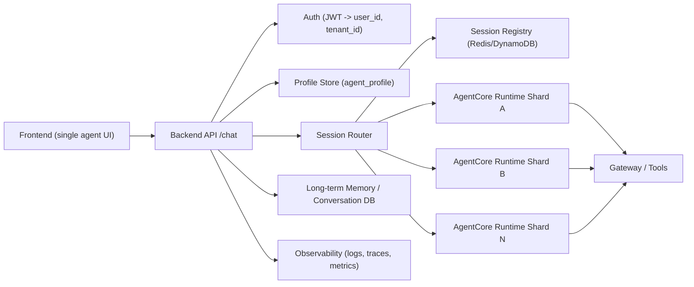
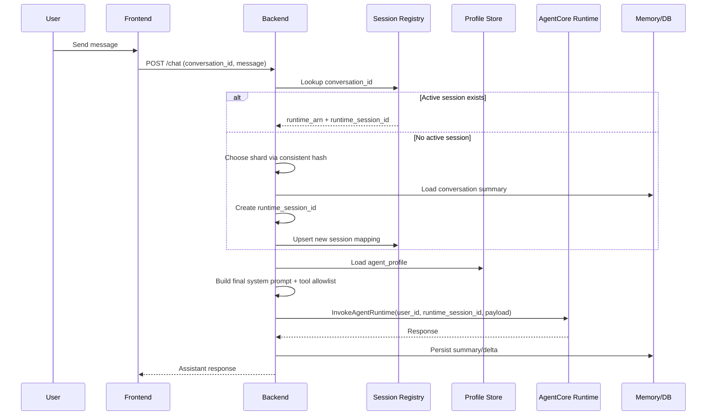

# AgentCore Multi-Tenant Runtime Schema (for 60k users)

## Goal
- Keep one logical agent experience on frontend.
- Avoid creating new Runtime per prompt/tool/skill change.
- Support high concurrency with runtime shard pool and sticky sessions.

## Core principle
- Runtime version changes only when code/dependencies/network policy changes.
- User-level config (prompt/tools/skills/model params) lives in data, not in Runtime artifact.

## High-level architecture


## Data model

### 1) `agent_profile`
- `profile_id` (pk)
- `tenant_id`
- `user_id`
- `base_prompt_template_id`
- `user_prompt_patch`
- `enabled_skills` (json array)
- `allowed_tools` (json array)
- `model_params` (json)
- `profile_version` (int)
- `updated_at`

### 2) `session_registry`
- `conversation_id` (pk)
- `tenant_id`
- `user_id`
- `runtime_arn`
- `runtime_qualifier`
- `runtime_session_id`
- `status` (`active|draining|closed`)
- `expires_at`
- `last_seen_at`

### 3) `conversation_state`
- `conversation_id` (pk)
- `tenant_id`
- `user_id`
- `history_summary`
- `memory_pointer` (Memory resource id / DB key)
- `last_message_at`

### 4) `runtime_shards`
- `shard_id` (pk)
- `runtime_arn`
- `runtime_qualifier`
- `weight`
- `state` (`active|draining|disabled`)
- `region`

## Request lifecycle


## Scale up / down behavior

### Scale up (e.g., 4 -> 17 shards)
- Add shards in `runtime_shards` with `state=active`.
- New sessions are assigned by hash-ring with minimal remap.
- Existing active sessions stay pinned to their shard.

### Scale down (e.g., 17 -> 4 shards)
- Mark selected shards as `draining`.
- Stop assigning new sessions to draining shards.
- Keep serving old sessions until they end/expire.
- After drain timeout, close remaining sessions and rely on rehydration from memory on next request.

## Session continuity rule
- Runtime session is short-lived compute context (idle timeout / max lifetime).
- "Continue tomorrow" should be implemented as:
  1. Create new runtime session.
  2. Rehydrate from `conversation_state` + memory.
  3. Continue with same `conversation_id` at app level.

## Routing algorithm (backend)
```text
if registry.has_active(conversation_id):
    target = registry.get(conversation_id)
else:
    target = hash_ring.pick(tenant_id + ":" + user_id)
    session_id = new_runtime_session_id()
    registry.upsert(conversation_id, target, session_id, expires_at)

profile = load_agent_profile(user_id, tenant_id)
payload.system_prompt = render(base_prompt, profile.user_prompt_patch)
payload.allowed_tools = intersect(profile.allowed_tools, tenant_policy_allowlist)
invoke(target.runtime_arn, target.qualifier, session_id, payload, runtime_user_id=user_id)
persist_conversation_delta(conversation_id, response)
```

## What creates a new Runtime version
- Agent code changes.
- Dependency or OS-level package changes.
- Network/IAM/security boundary changes.
- Breaking tool contract changes.

## What must NOT create a new Runtime version
- Prompt text edits.
- Turning skills/tools on/off from approved catalog.
- Model parameter changes (`temperature`, `max_tokens`, etc.).
- User-level personalization.

## Operational guardrails
- Enforce per-tenant tool allowlist server-side.
- Do not trust frontend for `user_id` or tool selection.
- Track metrics: active sessions, session create rate, invoke TPS, p95 latency, error rate by shard.
- Alert on shard imbalance and registry misses.

## Migration from current model
1. Freeze runtime artifact creation for profile-only edits.
2. Introduce `agent_profile` and `session_registry`.
3. Move prompt/tools/skills customization into backend request assembly.
4. Keep existing Runtime(s), then add shard pool gradually.
5. Add rehydration path before enabling aggressive scale-down.
