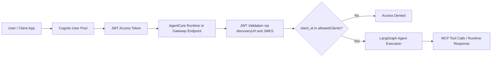

# AgentCore + LangGraph Workshop Cheat Sheet

## 1) Архітектурна Модель: LangGraph vs AgentCore

### LangGraph
LangGraph відповідає за оркестрацію агентної логіки: стан, вузли, ребра, інструментальний цикл, checkpoint-памʼять на рівні потоку (`thread_id`) і керування виконанням крок за кроком.

### AgentCore Runtime
AgentCore Runtime відповідає за хостинг агента в AWS: endpoint, lifecycle деплою, інвокацію, інтеграцію з авторизацією, логуванням і керованою інфраструктурою виконання.

### Gateway (MCP)
AgentCore Gateway є містком між агентом і зовнішніми інструментами/API через MCP-протокол (`tools/list`, `tools/call`), включно з OAuth-сценаріями для user-federation та app-to-app доступу.

---

## 2) Канонічний Контракт Runtime-деплою

Для деплою агента в AgentCore Runtime код має містити 4 обовʼязкові елементи:

1. Імпорт runtime app:
`from bedrock_agentcore.runtime import BedrockAgentCoreApp`
2. Ініціалізація застосунку:
`app = BedrockAgentCoreApp()`
3. Декорація точки входу:
`@app.entrypoint`
4. Запуск серверного процесу під контролем Runtime:
`app.run()`

Цей контракт є стабільною основою для будь-якої реалізації агента, незалежно від складності внутрішньої логіки.

---

## 3) Framework-Only Підхід (без самописного agent loop)

Рекомендований стек для workshop:

1. Модель: `ChatBedrockConverse` (`langchain-aws`)
2. Агентний цикл: `create_react_agent` (`langgraph.prebuilt`)
3. Інструменти: `@tool` (`langchain_core.tools`)
4. Памʼять потоку: `InMemorySaver` + `thread_id`

Цей підхід мінімізує custom-код і тримає рішення в межах офіційних концепцій LangGraph/Bedrock.

---

## 4) Локальний vs Деплойний Контур

### Локальний контур (для навчання)
Локальний ReAct-агент працює з mock-tools і реальним LLM, щоб сфокусуватись на механіці оркестрації та thread memory без OAuth/MCP складності.

### Деплойний контур (production-like)
Деплойна версія працює з реальним Gateway, OAuth-флоу та інструментами з MCP pool. Це повний E2E сценарій з авторизацією і зовнішніми інтеграціями.

---

## 5) ReAct Патерн у Workshop

Базова стратегія:

1. Спершу отримати контекст з основного джерела (Google Doc tool).
2. Якщо контекст недостатній, викликати fallback web search tool.
3. Синтезувати відповідь на основі фактичних tool outputs.
4. Додавати джерела (`Sources`) у фінальну відповідь.

Це дає керовану і пояснювану поведінку агента без “чорної скриньки”.

---

## 6) Поточні Домовленості для Workshop

1. Пріоритет: готові бібліотеки і офіційні патерни.
2. Мінімум самописного коду там, де є фреймворковий еквівалент.
3. Теорія в документах формулюється як самостійні поняття, а не як відповіді у стилі Q&A.
4. Цей файл поповнюється інкрементально після кожного важливого питання/блоку.

---

## 7) STEP 3: Inbound Authentication

### Визначення
Inbound Authentication — це контроль доступу на вході до endpoint агента: хто саме має право викликати Runtime/Gateway і за яким механізмом ідентифікації.

### Яку задачу вирішує
Без inbound auth будь-хто, хто знає endpoint, потенційно може інвокати агента. Це створює ризики:

1. Неавторизовані запити та витік даних.
2. Неконтрольовані витрати (зловживання інвокаціями).
3. Порушення політик доступу і комплаєнсу.
4. Відсутність трасування “хто саме викликав агента”.

Inbound auth закриває ці ризики через валідацію ідентичності та політик до виконання бізнес-логіки агента.

### Основні режими

1. IAM/SigV4
Підходить для service-to-service і внутрішніх AWS сценаріїв. Клієнт підписує запит AWS-підписом, а доступ перевіряється IAM політиками.

2. OAuth/JWT (OIDC)
Підходить для user-facing застосунків та федерації ідентичностей. Endpoint приймає bearer token, перевіряє issuer, audience/client і claims.

### Чому саме AgentCore є сильним інструментом

1. Централізований auth-контур
Авторизація конфігурується на рівні Runtime/Gateway, а не розмазується по коду нод і тулз.

2. Чисте розділення відповідальностей
LangGraph відповідає за агентну логіку, AgentCore — за доступ, безпеку, endpoint lifecycle.

3. Офіційна інтеграція з Cognito/OIDC
Можна швидко побудувати production-потік із валідацією JWT, allowed clients, scopes.

4. Кращий операційний контроль
Логи, request tracing і доступні метадані сесій дають аудитованість та контроль інцидентів.

### Практичний меседж для презентації
Inbound Authentication — це не “додаткова фіча”, а базовий security perimeter агента. AgentCore знімає цю задачу з бізнес-логіки й надає керований, стандартизований шар доступу для production.

### Як Inbound Auth працює в нашому workshop-прикладі

1. Клієнт отримує user access token з Cognito User Pool.
2. Клієнт викликає AgentCore Runtime/Gateway з bearer token у `Authorization` header.
3. AgentCore перевіряє JWT через `discoveryUrl` (OIDC metadata + JWKS).
4. Додатково перевіряється, чи `client_id` входить до `allowedClients` конфігурації authorizer.
5. Лише після успішної валідації токена запит допускається до виконання агентної логіки та tool calls.
6. Якщо токен невалідний/неприпустимий — запит блокується до входу в LangGraph flow.

### Схема потоку (наш приклад)

### Артефакти, які ми отримали в STEP 3, і як їх використовуємо

`user_pool_id`  
Ідентифікатор Cognito User Pool (issuer realm). Визначає, де живуть користувачі та хто видає JWT.

`user_client_id`  
Ідентифікатор App Client у цьому пулі. Використовується:
1. для отримання user token (auth flow),
2. у `allowedClients` конфігурації Gateway/Runtime authorizer.

`discovery_url`  
OIDC discovery endpoint для пулу. Через нього authorizer знаходить issuer/JWKS/метадані і перевіряє підпис JWT.

`demo_username`  
Тестовий користувач для workshop-демонстрацій. У production це замінюється реальним user lifecycle.

`access_token_length`  
Індикатор, що токен реально отримано. Це технічна sanity-check метрика (не security-перевірка).

#### Де це застосовується далі

1. STEP 4 (Gateway authorizer):
- `discovery_url` підключається в `customJWTAuthorizer.discoveryUrl`.
- `user_client_id` додається в `allowedClients`.

2. Локальні/Runtime invoke:
- User token передається як bearer token для inbound auth.
- Runtime/Gateway допускає запит лише після валідації токена.

3. OAuth user-federation для external tools:
- Після inbound валідації цей же user context використовується для user-bound outbound доступу (через `complete_resource_token_auth` у відповідному флоу).

#### Практичний висновок
STEP 3 формує identity baseline для всіх наступних кроків: без цих артефактів неможливо коректно налаштувати ні авторизований Gateway, ні user-scoped виклики агента.

### Як AgentCore використовує OIDC metadata під час inbound перевірки

1. На етапі конфігурації authorizer AgentCore отримує `discoveryUrl`.
2. Під час invoke AgentCore читає bearer JWT із `Authorization` header.
3. Із JWT header береться `kid`, а з discovery-метаданих дістається `jwks_uri`.
4. За `jwks_uri` AgentCore отримує (і кешує) публічні ключі issuer-а.
5. Перевіряється криптографічний підпис JWT (`RS256`) по ключу з відповідним `kid`.
6. Перевіряються claims: як мінімум `iss` (має збігатись з metadata `issuer`), `exp`/час життя, а також client/audience обмеження згідно конфігурації.
7. Додатково перевіряється allowlist клієнтів (`allowedClients`) для `client_id`.
8. Якщо будь-яка перевірка падає, AgentCore повертає `401/403` і не запускає LangGraph logic.
9. Якщо перевірка проходить, запит передається у runtime entrypoint і далі в агентний workflow.

### Як робити per-user authorization (коли одного client_id недостатньо)

Базовий inbound в AgentCore гарантує, що токен валідний і від дозволеного `client_id`, але бізнес-правила доступу на рівні конкретного користувача потрібно додати окремо.

Рекомендований патерн:

1. У Cognito видавати user claims для авторизації (`scope`, `cognito:groups`, custom claims).
2. У `@app.entrypoint` читати `Authorization` із `context.request_headers`.
3. Декодувати JWT claims (або з verify, або trust-after-verify якщо довіряємо попередній валідації AgentCore).
4. Явно перевіряти бізнес-умову доступу (наприклад, потрібна група).
5. Якщо умова не виконана — повертати `403`-подібну відповідь і не запускати агентну логіку.

Технічний факт зі SDK:

1. Runtime передає `Authorization` у `RequestContext.request_headers`.
2. Другий аргумент `entrypoint` має називатись `context`, щоб SDK передав його в handler.

---

## 8) STEP 4: Gateway and Execution Role

### Що відбувається концептуально
На цьому етапі створюється керований “вхідний шлюз” для агентних тулз:

1. IAM execution role для Gateway.
2. MCP Gateway з протоколом і версією, сумісною з потрібними флоу.
3. Inbound JWT authorizer (OIDC discovery + allowlist client_id).
4. Стан “READY”, після якого Gateway готовий приймати `tools/list` і `tools/call`.

### Покрокова логіка

1. `ensure_role(...)`
Ідемпотентно створює роль або оновлює trust policy для існуючої ролі, після чого прикріплює inline policy.

2. Trust policy з умовами `aws:SourceAccount` і `aws:SourceArn`
Обмежує, хто саме може асюмити роль. Це anti-confused-deputy захист і базова вимога безпечного cross-service assume role.

3. Inline policy для Gateway
Надає мінімально потрібні права:
- виклики сервісів AgentCore,
- читання секретів (OAuth/client secrets),
- виклик Lambda target-ів,
- запис логів у CloudWatch.

4. Перевірка існування Gateway (`list_gateways_all`)
Якщо Gateway уже є — сценарій update, якщо немає — create.

5. Create/update Gateway
Конфігуруються:
- `protocolType='MCP'`
- `supportedVersions=['2025-11-25']`
- `searchType='SEMANTIC'`
- `authorizerType='CUSTOM_JWT'`
- `authorizerConfiguration.customJWTAuthorizer.discoveryUrl`
- `allowedClients` (список client_id, які мають право виклику)

6. `wait_gateway_ready(...)`
Опитує статус до `READY`; у випадку `FAILED/DELETING` кидає помилку.

7. Формується `gateway_state`
Зберігаються ключові артефакти для наступних кроків:
- `gateway_id`
- `gateway_url`
- `gateway_arn`
- `supported_versions`

### Що це дає в архітектурі
Цей етап відділяє транспорт/безпеку від логіки агента:
- Gateway відповідає за auth + доступ до тулз,
- LangGraph відповідає за decision loop і оркестрацію.
Такий поділ зменшує складність коду агента і спрощує production-експлуатацію.

---

## 9) STEP 5: Outbound OAuth Provider + OpenAPI Target (без Lambda)

### Головна ідея
У цьому E2E воркшопі Gateway не потребує Lambda для Google Docs кейсу. Ми підключаємо Google API напряму як OpenAPI target.

### Що робимо

1. Створюємо/оновлюємо OAuth2 credential provider в AgentCore (Google client id/secret).
2. Отримуємо `provider_arn` і `callback_url`.
3. Реєструємо `callback_url` в Google OAuth app (Authorized redirect URI).
4. Створюємо MCP Gateway target з `targetConfiguration.mcp.openApiSchema`.
5. У `credentialProviderConfigurations` для target вказуємо `provider_arn`, scope і grant type.

### Що таке `google_docs_openapi`
`google_docs_openapi` — це схема інструмента для Gateway:

1. `servers: https://docs.googleapis.com`
2. `paths: /v1/documents/{documentId}`
3. `operationId: getDocument`

Gateway використовує цю схему, щоб експонувати MCP tool (`tools/list`, `tools/call`) без проміжної Lambda-функції.

### Чому це важливо

1. Менше компонентів: немає окремого Lambda коду і деплою.
2. Швидше для workshop: фокус на AgentCore OAuth + MCP інтеграції.
3. Чистіший production-патерн для API-first інтеграцій.

---

## 9) Workshop Hardening Rules (Validated)

### Rule 1: Gateway for 3LO must use MCP version `2025-11-25`
If gateway is on older MCP protocol configuration, `create_gateway_target` with OAuth 3LO fails with:
`ValidationException: Protocol configuration on gateway is required for 3LO authentication`.

Practical rule:
1. Verify gateway `protocolConfiguration.mcp.supportedVersions` contains `2025-11-25`.
2. If not, create a new gateway with that supported version and reuse role/authorizer settings.

### Rule 2: Runtime session id has minimum length constraint
Runtime invoke over HTTP requires `X-Amzn-Bedrock-AgentCore-Runtime-Session-Id` length >= 33.
Short ids cause `400 Bad Request` validation errors.

Practical rule:
Use deterministic long ids, for example:
`m11-runtime-react-demo-000000000000001`

### Rule 3: Avoid relying on `agentcore invoke` error parsing for workshop demos
Current CLI may throw an internal traceback after HTTP errors, obscuring root cause.

Practical rule:
For workshop reliability, call runtime endpoint directly with `requests` + bearer JWT and inspect status/body explicitly.

### Rule 4: Separate build from smoke-tests
External LLM/tool calls can be slow.

Practical rule:
1. Build local ReAct agent in one cell.
2. Put live smoke-test in an optional cell controlled by env flag (`RUN_LOCAL_SMOKE_TEST`).

### Rule 5: Add a health gate before deploy
Before runtime deploy, assert:
1. Gateway selected is `2025-11-25` compatible.
2. Google Docs tool name is present.
3. OAuth provider callback URL exists (and is registered in Google OAuth client).

This prevents “deploy succeeded but invoke fails later” scenarios.
